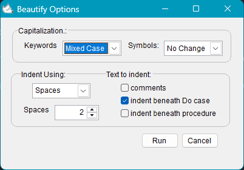

# Foxpro Beautify

Uses Visual Foxpro beautify to format your code:

## v 1.1.2
removed min-max buttons / bug fix closing window using close button / 20 secs auto-close 

## V 1.1.1
auto center window in multiple monitors 

## v 1.1.0
Added preferences window

## v 1.0.0
Initial release w/ preconfigured options

## Shortcut:
shift+Alt+F or select Format Code from context menu

2025, Marco Plaza  
[GitHub/nfoxdev](https://github.com/nfoxdev)