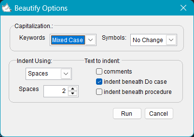

# Foxpro Beautify

Formats your Visual Foxpro code (prg/vc2/sc2/fr2) using VFP beautify.

## Shortcut

Alt+Shift+F or select Format Code from right click menu

Please make a donation! fuel the development of new FoxPro extensions for VS Code!

## v 1.1.2

removed min-max buttons / bug fix closing window using close button / 20 secs auto-close

## V 1.1.1

auto center window in multiple monitors

## v 1.1.0

Added preferences window

## v 1.0.0

Initial release w/ preconfigured options

2025, Marco Plaza  
[GitHub/nfoxdev](https://github.com/nfoxdev)
